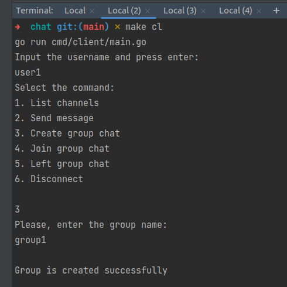

# Simple chat app

## How to run

1. make srv - runs the server via cli
2. make cl - runs a client via cli

## A few "features" of the project:

- No env variables - server and client are hardcoded to 7775 port
- No docker (cause why)
- No tests

## Examples of work

Sever

Client

